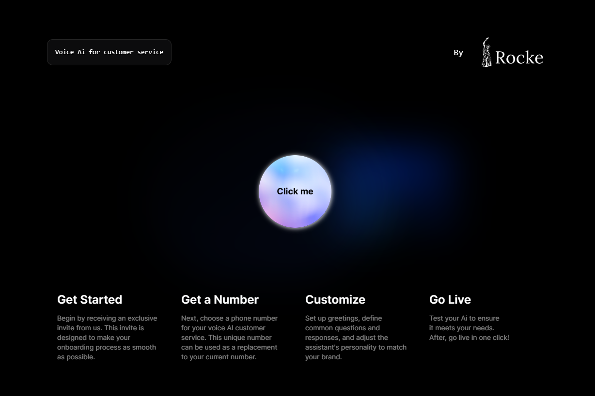

# Thomas Rocke Digital CV

Welcome to my digital CV! This project showcases my skills, education, and projects in a visually organized and interactive format. Below is an overview of the contents of the CV.

---

## Table of Contents

- [Overview](#overview)
- [Features](#features)
- [Tech Stack](#tech-stack)
- [Education](#education)
- [Projects](#projects)
- [Contact Information](#contact-information)

---

## Overview

This digital CV is designed to provide a concise and visually appealing summary of my professional background. It includes my contact details, education, technical skills, and notable projects.

---

## Features

- **Contact Section**: Provides direct links to email, phone, and LinkedIn.
- **Education Timeline**: Highlights my educational achievements and certifications.
- **Skills Section**: Lists my technical skills in frontend, backend, and deployment technologies.
- **Projects**: Showcases key projects with descriptions and links.

---

## Tech Stack

### Frontend Technologies
- HTML
- CSS
- Bootstrap
- Tailwind CSS
- JavaScript
- React
- Next.js
- React Native

### Backend Technologies
- Python
- Flask
- FastAPI
- Docker
- PostgreSQL
- API Development

### Deployment & Hosting
- Git
- Supabase
- Render
- Netlify
- Vercel
- Apple Store Connect

---

## Education

- **Springboard**: Software Engineering Track, 2025
- **Udemy**: Multiple courses in React, Next.js, JavaScript, Flask, and Python, 2023–2024
- **Amazon Technical Academy**: 2022–2023
- **UMBC**: Full Stack Software Developer Foundations, 2021
- **FreeCodeCamp**: Responsive Web Design, 2020
- **Alderson Broaddus University**: Business Administration, 2016–2018
- **Arundel High School**: Graduated in 2016

---

## Projects

### [Trail Twin](https://apps.apple.com/us/app/trail-twin/id6560107425)
- **Description**: A mobile app for mountain bikers to find friends and rides. Users can search by name or location for connections and events.
- **Tech Used**: React Native (Frontend), Supabase (Backend)
- **Image**:
  

---

### [McQueen](https://ai.rocke.so/)
- **Description**: A voice AI customer service assistant for electricians, trained on common tasks. Includes a landing page for customer interactions.
- **Tech Used**: Next.js, Vapi API
- **Image**:
  

---

## Contact Information

- **Email**: [tjrocke365@gmail.com](mailto:tjrocke365@gmail.com)
- **Phone**: +1 443-373-6564
- **LinkedIn**: [Charles Rocke](https://www.linkedin.com/in/charles-rocke-716bb71ab/)

---

©️ 2025 Thomas Rocke Digital CV
